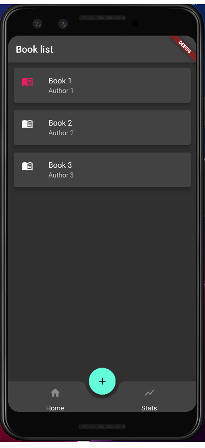

[](https://github.com/CiucurDaniel/BookList/actions/workflows/flutter-ci.yml)

# Book list


Booklist, your app for keeping track of the books you read and want to read. Cross-platform iOS and Android.


## Current status of the application

The application is still at the initial development, however here is a small preview of how it looks.



# Project structure

```
lib
├───cubits
├───data
│   ├───data_sources
│   │   └───local
│   ├───models
│   └───repositories
└───presentation
    ├───screens
    └───widgets
```

Following the architecture guides from the official [Bloc documentation](https://bloclibrary.dev/#/architecture), this project is split into 3 main layers.
We have the `Data layer` which has the `data sources` and the `repositories` as well as the `models` for the application. Next is the `Bussiness logic` layer which contains the Cubits/Blocs. And the last is the `Presentation` layer which contains the `screens` and the `widgets`.


# TODO

* [ ] Add new book screen
* [ ] Edit book screen (reuse above mentioned screen)
* [ ] Filter books by status
* [ ] Delete book
* [ ] Connect Status bloc to UI
* [ ] Improve spacing on bottom navigation
* [ ] Create a theme for the application
* [ ] theme 1 part: text
* [ ] theme 2 part: colors
* [ ] theme 3 part: spacing and colors